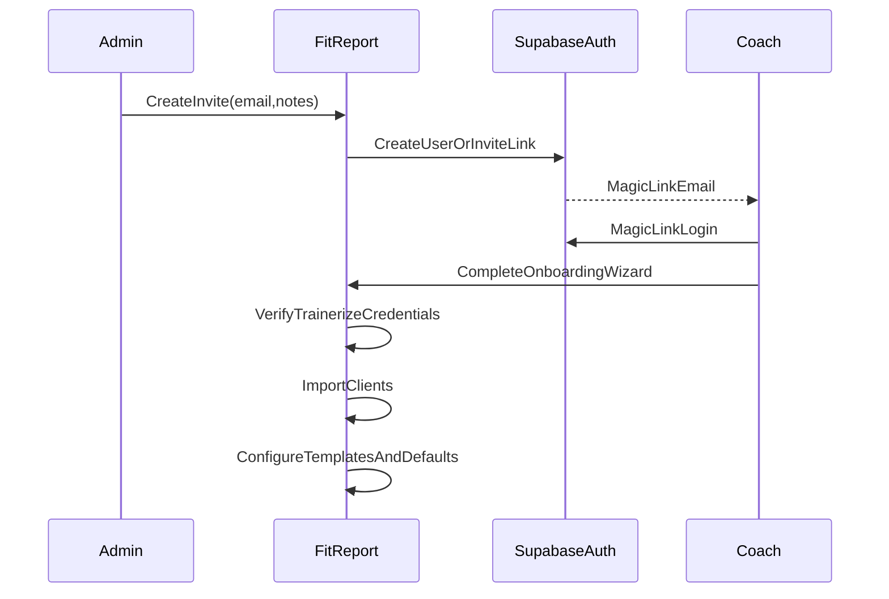

## Updated goal

- Run FitReport as a **hybrid SaaS + concierge onboarding** product.
- **No Stripe gating initially**: coaches pay you directly; you provision access manually.
- **Provisioning model**: **invite by email → magic link → set password**.
- **Stripe handling**: **keep Stripe code**, but disable gating and hide billing UI.

## Product flow (new)

## What to change in the app (concrete)

### 1) Disable Stripe-based access gating (keep code)

- **Behavior**: any authenticated invited user can access dashboard.
- **UI**: hide subscription/upgrade/portal sections.
- **Code**: keep `[app/api/stripe/](/Users/riley/CODE/fit-report-sf/fit-report/app/api/stripe)` and `[app/api/webhook/stripe/route.ts](/Users/riley/CODE/fit-report-sf/fit-report/app/api/webhook/stripe/route.ts)` in-place, but remove them from critical path.
- **Data model**: keep `profiles.has_access` if it exists, but stop using it for auth gating during concierge phase.

### 2) Add a safe “invite/provision trainer” mechanism

- **Approach**: admin-only invite endpoint that generates a Supabase Auth invite/magic link and creates/updates a `profiles` row.
- **Admin auth**: protect with a server-side secret (e.g. `ADMIN_INVITE_SECRET`) and strict rate limiting.
- **Suggested storage**:
  - `profiles.invited_by_admin_at`, `profiles.onboarding_status` (or separate `trainer_onboarding` table)
  - optional `invites` table for audit/history (who invited, when, status)

### 3) Build a Studio-friendly onboarding wizard (your differentiation)

- **Steps**:
  - Connect Trainerize (credentials + verify)
  - Import clients (bulk)
  - Set default templates/config (signature, excluded workouts, report sections)
  - Run a “sample report” on 1 client
  - Schedule weekly campaign (optional)
- **Outcome**: value in first session, minimal back-and-forth.

### 4) Concierge/managed-service support tools (internal)

- **Internal dashboard** to:
  - see all invited accounts + onboarding status
  - trigger client import
  - trigger a bulk report run
  - view failures + retry
  - view report delivery logs

## Still-highest priority hardening (even without Stripe)

- Encrypt Trainerize credentials at rest (`[libs/encryption.ts](/Users/riley/CODE/fit-report-sf/fit-report/libs/encryption.ts)`; follow the approach in `[PRODUCTION_HARDENING_PLAN.md](/Users/riley/CODE/fit-report-sf/fit-report/PRODUCTION_HARDENING_PLAN.md)`).
- Finish scheduled reports end-to-end (API + cron + manage UX).
- Add Trainerize reliability layer (retry/backoff, 429 handling, stale-cache fallback, route-level limits).

## Near-term “best option for Studio coaches” features (high ROI)

- **Weekly campaigns**: cohorts + bulk generation + bulk send + retry queue.
- **Engagement tracking**: link opens / delivery log → “who didn’t read” list.
- **Churn-risk flags**: missed workouts, steps collapse, sleep drop, stalled progress.
- **Playbooks**: 1-click message/task suggestions tied to those flags.

## Key files/areas likely to touch when implementing

- Dashboard gating and layout: `[app/dashboard/layout.tsx](/Users/riley/CODE/fit-report-sf/fit-report/app/dashboard/layout.tsx)` and any auth checks in `[middleware.ts](/Users/riley/CODE/fit-report-sf/fit-report/middleware.ts)` / Supabase middleware.
- Invite/admin API: new route(s) under `[app/api/admin/](/Users/riley/CODE/fit-report-sf/fit-report/app/api)`.
- Trainerize setup UX: `[app/dashboard/trainerize/page.tsx](/Users/riley/CODE/fit-report-sf/fit-report/app/dashboard/trainerize/page.tsx)`.
- Scheduling: `[components/ScheduleReportModal.tsx](/Users/riley/CODE/fit-report-sf/fit-report/components/ScheduleReportModal.tsx)` + new schedule processor route.

