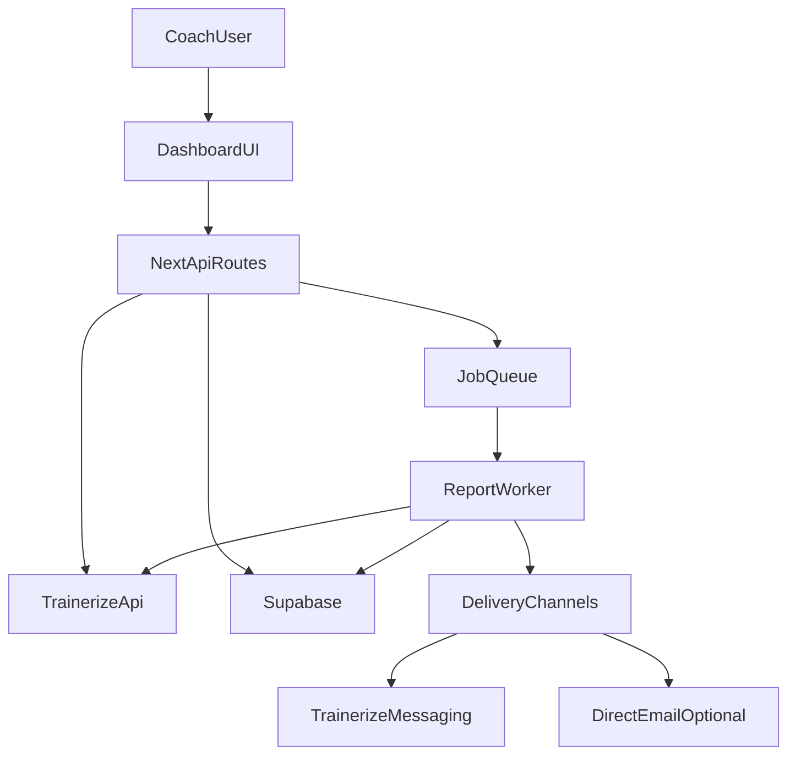

## Product direction (based on your answers)

- **Hybrid**: self-serve SaaS core + paid onboarding/managed add-on.
- **ICP**: **Trainerize Studio coaches** managing **60+ active clients** → they care most about speed, reliability, bulk operations, team workflows, and outcomes (retention, adherence, capacity).

## What FitReport already has (so we build on it)

- **Report generation pipeline**: server-side, parallel fetches, caching (`[lib/report-generator.ts](/Users/riley/CODE/fit-report-sf/fit-report/lib/report-generator.ts)`, `[lib/trainerize-cache.ts](/Users/riley/CODE/fit-report-sf/fit-report/lib/trainerize-cache.ts)`, `[app/api/reports/generate/route.ts](/Users/riley/CODE/fit-report-sf/fit-report/app/api/reports/generate/route.ts)`).
- **Share links + public report view** (time-limited links) (`[app/api/reports/generate-link/route.ts](/Users/riley/CODE/fit-report-sf/fit-report/app/api/reports/generate-link/route.ts)`, `[app/api/reports/public/[id]/route.ts](/Users/riley/CODE/fit-report-sf/fit-report/app/api/reports/public/[id]/route.ts)`).
- **Delivery via Trainerize messaging** (`[app/api/trainerize/send-fitness-report/route.ts](/Users/riley/CODE/fit-report-sf/fit-report/app/api/trainerize/send-fitness-report/route.ts)`).
- **Client management + notes/goals** (`[app/dashboard/clients/](/Users/riley/CODE/fit-report-sf/fit-report/app/dashboard/clients)` + `[supabase/migrations/20260128000000_add_client_goal.sql](/Users/riley/CODE/fit-report-sf/fit-report/supabase/migrations/20260128000000_add_client_goal.sql)`).
- **AI “client tasks” automation** (`[app/api/automations/generate-tasks/route.ts](/Users/riley/CODE/fit-report-sf/fit-report/app/api/automations/generate-tasks/route.ts)`).
- **Stripe + access gating** (but needs schema alignment) (`[app/api/webhook/stripe/route.ts](/Users/riley/CODE/fit-report-sf/fit-report/app/api/webhook/stripe/route.ts)`, `[config.ts](/Users/riley/CODE/fit-report-sf/fit-report/config.ts)`).

## Biggest gaps to close before “best-in-class for Studio coaches”

- **Scheduling is incomplete**: DB + UI exist, but missing API processing/cron & “manage schedules” UX (`[supabase/migrations/20240321000000_create_scheduled_reports.sql](/Users/riley/CODE/fit-report-sf/fit-report/supabase/migrations/20240321000000_create_scheduled_reports.sql)`, `[components/ScheduleReportModal.tsx](/Users/riley/CODE/fit-report-sf/fit-report/components/ScheduleReportModal.tsx)`).
- **Trainerize credentials stored plaintext** → must encrypt-at-rest before scaling (`[PRODUCTION_HARDENING_PLAN.md](/Users/riley/CODE/fit-report-sf/fit-report/PRODUCTION_HARDENING_PLAN.md)`, `[libs/encryption.ts](/Users/riley/CODE/fit-report-sf/fit-report/libs/encryption.ts)`).
- **Reliability at Studio volume**: retries/backoff, 429 handling, rate limiting on Trainerize routes, circuit breaker, stale-cache fallback.
- **Multi-user studio reality**: currently “single trainer per account”; Studio orgs often need multiple staff with roles, shared templates, shared reporting operations.
- **Plan/usage model**: hardcoded storage limits (e.g., max reports per client) aren’t aligned to subscription tiers (`[app/api/reports/store/route.ts](/Users/riley/CODE/fit-report-sf/fit-report/app/api/reports/store/route.ts)`).

## “Far and away the best option” = differentiated workflows (not just pretty reports)

These are Studio-scale features that directly increase a trainer’s capacity and retention.

### 1) Bulk reporting workflows (Studio ops)

- **Weekly report campaigns**: pick cohort → schedule cadence → auto-generate → auto-send → track completion.
- **Cohorts & filters**: by goal, plan, risk flags, compliance, new clients, churn-risk.
- **Queue + concurrency controls**: run 100+ reports reliably with progress + retry.
- **Human-in-the-loop review** (hybrid advantage): optional “approve before send” or “managed send”.

### 2) Client engagement + retention dashboard (your moat)

- **Read/engagement tracking**: link opens, time-on-report, reply rate (where possible), trend over time.
- **Risk flags**: “likely to churn” signals (missed workouts, weight trend stalls, low check-in consistency, sleep drop, steps collapse).
- **Coach actions**: one-click “send nudge”, “assign task”, “schedule consult”, “edit plan note”.

### 3) Actionable insights & “coach playbooks”

- Convert data into **recommendations** with templated messaging and tasks:
  - Training: progressive overload gaps, missed sessions, exercise substitutions.
  - Nutrition: adherence drift, protein targets.
  - Recovery: sleep debt streaks.
- **Playbooks** by persona/goal (fat loss, muscle gain, return-to-training) that auto-suggest:
  - message snippets
  - tasks
  - next-week focus

### 4) Branding + deliverability advantages

- **Studio brand kit**: logos, tone presets, signatures, white-label report links.
- **Message template library**: high-performing messages by scenario (plateau, great week, missed week).
- **Deliverability options**: keep Trainerize messaging, but add optional direct email (Resend) for studios who want it.

### 5) Team/org SaaS features (Studio version)

- **Organization accounts** with roles:
  - owner/admin/coach/assistant
  - shared client assignments
  - shared templates/config
  - audit log of sends/config changes
- **Managed services admin panel**: internal tools to run/report/send on behalf of customers.

## Target architecture changes (SaaS + managed service)

- **Queue/worker** becomes critical for 60+ clients: batching, retries, backoff, concurrency limits, reporting.
- **Org/team tenancy**: migrate from “trainer_id only” to “org_id + membership” where needed.

## Implementation roadmap (high-level, actionable)

### Phase A — SaaS hardening (must-do before scaling)

- Encrypt Trainerize credentials at rest (use `[libs/encryption.ts](/Users/riley/CODE/fit-report-sf/fit-report/libs/encryption.ts)`; follow the approach described in `[PRODUCTION_HARDENING_PLAN.md](/Users/riley/CODE/fit-report-sf/fit-report/PRODUCTION_HARDENING_PLAN.md)`).
- Add reliability layer for Trainerize fetches (retry/backoff, 429 handling, stale-cache fallback).
- Finish scheduled reports end-to-end: API endpoints + cron processing + “manage schedules” UI.
- Align Supabase schema with Stripe webhook expectations (add missing profile subscription columns; ensure RLS remains correct).

### Phase B — Studio “scale” features (differentiation)

- Weekly campaign workflow + bulk scheduling.
- Engagement/risk dashboard.
- Playbooks + AI-assisted actions (tasks/messages) with guardrails + review mode.

### Phase C — Hybrid managed service productization

- Admin tooling: run campaigns for customers, QA queue, support view, audit log.
- “Concierge onboarding”: import clients, configure templates, first campaign setup.

## Key files likely to touch (when you’re ready to implement)

- Scheduling: `[components/ScheduleReportModal.tsx](/Users/riley/CODE/fit-report-sf/fit-report/components/ScheduleReportModal.tsx)`, `[supabase/migrations/20240321000000_create_scheduled_reports.sql](/Users/riley/CODE/fit-report-sf/fit-report/supabase/migrations/20240321000000_create_scheduled_reports.sql)`, new API route(s) under `[app/api/](/Users/riley/CODE/fit-report-sf/fit-report/app/api)`.
- Trainerize reliability/security: `[app/api/trainerize/](/Users/riley/CODE/fit-report-sf/fit-report/app/api/trainerize)`, `[lib/report-generator.ts](/Users/riley/CODE/fit-report-sf/fit-report/lib/report-generator.ts)`, `[lib/trainerize-cache.ts](/Users/riley/CODE/fit-report-sf/fit-report/lib/trainerize-cache.ts)`.
- Billing/tiers/limits: `[app/api/webhook/stripe/route.ts](/Users/riley/CODE/fit-report-sf/fit-report/app/api/webhook/stripe/route.ts)`, `[config.ts](/Users/riley/CODE/fit-report-sf/fit-report/config.ts)`, `[app/api/reports/store/route.ts](/Users/riley/CODE/fit-report-sf/fit-report/app/api/reports/store/route.ts)`.
- Teams/orgs + RLS: `[supabase/migrations/](/Users/riley/CODE/fit-report-sf/fit-report/supabase/migrations)`.

