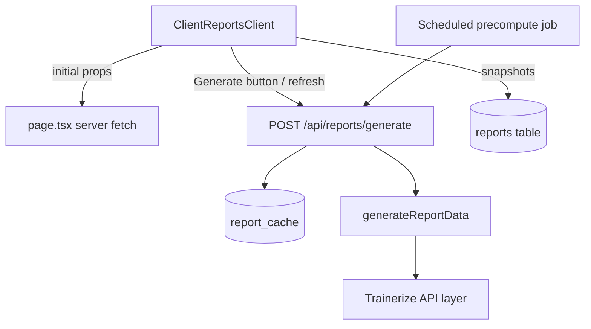

# Optimize Live Report Loading

## Goals

- **Reduce time-to-first-meaningful-content** on `[id]/reports` so the page feels instant even when live generation is slow.
- **Minimize synchronous work on the request path** for `/api/reports/generate` where possible.
- **Leverage caching and background jobs** so common report ranges almost always hit warm cache.

## Current Flow (for context)

- **Route & page**: `[app/dashboard/clients/[id]/reports/page.tsx](app/dashboard/clients/[id]/reports/page.tsx)` is a thin server wrapper around the client component:

```3:4:app/dashboard/clients/[id]/reports/page.tsx
export default function ClientReportsPage({ params }: { params: { id: string } }) {
  return <ClientReportsClient clientId={params.id} />;
}
```

- **Client component**: `[app/dashboard/clients/[id]/reports/ClientReportsClient.tsx](app/dashboard/clients/[id]/reports/ClientReportsClient.tsx)` is a large `'use client'` component that:
  - Fetches `client` and `reports` on mount via Supabase client SDK.
  - Auto-generates a live report via `/api/reports/generate` once `startDate`, `endDate`, and `client` are set:

```85:88:app/dashboard/clients/[id]/reports/ClientReportsClient.tsx
useEffect(() => {
  if (startDate && endDate && client && activeTab === 'live' && !liveReportData) {
    generateLiveReport();
  }
}, [startDate, endDate, client, activeTab]);
```

- Renders heavy visualizations with `ReportVisualization` and related UI.
- **Live report API**: `[app/api/reports/generate/route.ts](app/api/reports/generate/route.ts)`:
  - Authenticates user, fetches client, validates Trainerize ID.
  - Computes a SHA256 `cache_key` from `{trainerId, clientId, dateRangeStart, dateRangeEnd, template, repRange}` and checks `report_cache` for a `status = 'ready'` and non-expired row.
  - On cache hit: returns cached `report_data` immediately.
  - On cache miss: calls `generateReportData` from `[lib/report-generator.ts](lib/report-generator.ts)`, then inserts the result into `report_cache` with a 24-hour `expires_at`.
- **Report generation core**: `[lib/report-generator.ts](lib/report-generator.ts)`:
  - Calls six internal Trainerize API routes in parallel via `Promise.all` (`/workouts`, `/bodystats`, `/health-data`, `/nutrition`, `/sleep-data`, `/goals`).
  - Applies excluded-workout filtering and adds progressive overload notes.
  - Returns a large `ReportData` object consumed by the UI.
- **Bottlenecks today**:
  - First page load waits on **client-side Supabase queries** before showing anything useful.
  - First live report for a new date range waits for **six external Trainerize calls** plus processing.
  - Auto-generation on mount can make the first visit feel especially slow.
  - There is caching, but no **pre-warming** or **request deduplication**, and everything is driven from the client.

## Phase 0: Measure Baseline Performance

- **Add lightweight instrumentation** to understand timings before/after changes:
  - In `/api/reports/generate`, log durations for each major step: auth, client fetch, cache lookup, `generateReportData`, cache insert.
  - In `ClientReportsClient`, log time from initial render to:
    - Client/snapshots loaded.
    - Live report data available.
  - Use these logs (even if just `console.log` in development or a simple `performance_logs` table) to set realistic targets (e.g. "live report visible in < 2s on cache hit, < 5–8s on cold miss").

## Phase 1: Server-Preload & Cache-First Page Load

**Objective**: Make the page feel fast even before any heavy live generation.

1. **Move client & snapshots loading to the server page**
  - Update `[app/dashboard/clients/[id]/reports/page.tsx](app/dashboard/clients/[id]/reports/page.tsx)` to be `async` and use the Supabase **server** client to load:
    - The `client` row.
    - The list of `reports` for that client (ordered by `created_at DESC`).
  - Pass these as `initialClient` and `initialReports` props into `ClientReportsClient`.
  - In `ClientReportsClient`, refactor state so that it:
    - Initializes `client` and `reports` from props when provided.
    - Only falls back to the existing client-side Supabase fetch when props are missing (e.g. for legacy routes).
  - This removes an entire round-trip (client → Supabase) on initial load and allows the page shell plus client info to be server-rendered.
2. **Remove or gate the auto-generate-on-mount behavior**
  - Replace the unconditional auto-generate `useEffect` with a more deliberate strategy:
    - Option A (safer UX): **no auto-generate on first visit**; show the configuration panel and a clear "Generate Report" CTA, so first paint is instant.
    - Option B (cache-first): only auto-generate when a **warm cache is likely**, using a cache-only mode (see Phase 2), so the auto-call is cheap.
  - Keep the `Generate Report` button as the explicit trigger for actual cold generations.
3. **Optionally hydrate with the latest cached report on the server**
  - In the server page, look up the latest `report_cache` entry for the default 14-day range and current template/rep range (mirroring the cache key logic).
  - If a valid cached row exists, pass it as `initialLiveReportData` and `initialMetadata` props to `ClientReportsClient`, and initialize `liveReportData` from it.
  - Update the UI copy to indicate when a report is based on cached data (e.g. "Last refreshed 3h ago"), and add a small "Refresh" action to trigger a new generation without blocking the initial render.
4. **Lazy-load heavy visualization UI**
  - Wrap `ReportVisualization` in a Next.js `dynamic` import with a lightweight skeleton placeholder.
  - This reduces the initial JS bundle and hydration cost, especially for users who first interact with configuration and snapshots before viewing charts.

## Phase 2: `/api/reports/generate` and Caching Strategy Improvements

**Objective**: Make live report calls themselves faster and more robust, especially under load.

1. **Introduce a cache-only / non-blocking mode**
  - Extend `/api/reports/generate` to accept a mode flag (e.g. `?mode=cache-only` or a `mode` field in the body):
    - **cache-only**: if there is a valid `report_cache` row, return it; if not, return `202 Accepted` with a payload like `{ status: 'pending' }` and **do not** trigger heavy generation.
    - **default**: existing behavior (generate on miss).
  - Use cache-only mode for **background refresh checks** from the client so that normal navigation to the page doesn’t block on a cold, expensive run.
2. **Add simple request deduplication using `report_cache` status**
  - Extend the `report_cache` schema/usage to fully leverage a `status` column (e.g. `running`, `ready`, `error`):
    - When a generation starts, insert or upsert a row with `status = 'running'` and the same `cache_key`.
    - When another request comes in and sees `status = 'running'` for that `cache_key`, return a lightweight response like `{ status: 'running', cacheId }` instead of starting another generation.
    - The client can then either:
      - Poll a new `GET /api/reports/cache-status?cacheId=...` endpoint, or
      - Retry `/api/reports/generate` after a short delay.
  - This avoids N identical cold calls when multiple tabs/trainers happen to request the same report simultaneously.
3. **Incorporate unit settings into the cache key (if needed)**
  - Today the cache key includes `repRange` but not `unitBodystats`/`unitWeight` from the request.
  - If you intend to support per-request units (rather than fixed per-trainer settings), update `generateCacheKey` to include these fields and mirror that wherever reports are displayed.
4. **Add timeouts and graceful partial-failure handling in `generateReportData**`
  - Wrap each Trainerize fetch in an `AbortController` so a single slow upstream call doesn’t stall the whole report indefinitely.
  - Handle partial failures by returning degraded-but-useful data (e.g. missing sleep data) with clear UI messaging instead of full failure.
  - Log upstream failures and durations to identify chronic slowness by endpoint.
5. **Optionally adjust `expires_at` policy**
  - Once precomputation is in place (Phase 3), you can reduce or increase TTLs confidently:
    - Shorter TTL (e.g. 6–12h) for more "live" reports.
    - Longer TTL for purely weekly summary views.
  - The key is to align cache freshness with trainer expectations and your precompute schedule.

## Phase 3: Trainerize Data & Report Precomputation

**Objective**: Make most live report generations into **fast cache hits** instead of cold aggregates.

1. **Precompute common report ranges via scheduled jobs**
  - Use either **Vercel Cron** or a **Supabase Edge Function with a schedule** to periodically:
    - Iterate over active clients.
    - For each client, call `/api/reports/generate` for standard ranges (e.g. last 7 days, last 14 days) and templates you care about.
  - This populates `report_cache` proactively so UI calls during business hours mostly hit warm cache.
2. **Design a smarter precompute strategy based on usage**
  - Start with a static schedule (e.g. once nightly for all active clients).
  - Optionally refine later based on:
    - Clients with recent activity.
    - Clients whose trainers have opened the dashboard recently.
  - Store precompute metadata in `scheduled_reports` or a new `report_precompute_jobs` table so you can monitor and adjust.
3. **Introduce a Trainerize response cache (optional but powerful)**
  - Add a `trainerize_cache` table keyed by `{ trainer_id, client_id, type, startDate, endDate }` with short TTL (e.g. 2–4h).
  - In `generateReportData`, before hitting the Trainerize APIs, check this cache for each type (workouts, bodystats, etc.) and only hit the external API when necessary.
  - This can dramatically reduce both latency and external API load, especially if trainers re-run reports multiple times per day.
4. **Cleanup and monitoring**
  - Implement a periodic cleanup job to delete expired rows from `report_cache` (and `trainerize_cache` if added).
  - Add a simple dashboard or SQL views to inspect:
    - Cache hit rate.
    - Average generation time (cold vs warm).
    - Error rates by Trainerize endpoint.

## Phase 4: Client UX Polishing & Local Caching

**Objective**: Further improve perceived speed and interactivity.

1. **Show something useful immediately on the Live tab**
  - If `initialLiveReportData` (from cache) is available, render it immediately without waiting for any client-side fetch.
  - If not, but there is at least one saved snapshot, consider showing the **most recent snapshot** with a subtle notice (e.g. "Snapshot from X days ago") and a primary "Generate Latest Report" button.
2. **Background-refresh semantics in `ClientReportsClient**`
  - Add a small `isRefreshing` state separate from `isGeneratingLive`.
  - On mount, if `initialLiveReportData` exists, trigger a **non-blocking refresh check** using `/api/reports/generate` in cache-only mode:
    - If the API returns a new cached report with a more recent `generatedAt`, swap it in and show a small "Updated" toast.
    - If it returns pending/202, optionally schedule a retry, but don’t disrupt the current view.
3. **Optional: light-weight client-side persistence**
  - Store the last successful `liveReportData` and its metadata in `localStorage` keyed by `clientId + dateRange + template + repRange`.
  - On mount, if no `initialLiveReportData` is available from the server (e.g. local dev), hydrate from this local cache so users still see something instantly.
4. **Progressive loading of secondary sections**
  - Ensure sections like the "Action Plan" (which may involve GPT) do not block live report display.
  - Use separate loading spinners/states per section so the main chart and metrics are always the primary, quickly-visible content.

## High-Level Architecture After Changes




## Todos

- **baseline-metrics**: Instrument `/api/reports/generate` and `ClientReportsClient` to record current timings and set performance targets.
- **server-preload-client-and-reports**: Make the reports page server-fetch `client` and `reports` and pass them as initial props, refactoring `ClientReportsClient` accordingly.
- **cache-first-live-flow**: Adjust auto-generation logic and add an optional server-side cached report preload so that "live" views show something immediately and only generate on explicit user action or background refresh.
- **api-caching-improvements**: Extend `/api/reports/generate` for cache-only mode, request deduplication via `report_cache` status, and better error/timeout handling in `generateReportData`.
- **precompute-and-trainerize-cache**: Introduce scheduled precompute jobs and, optionally, a Trainerize response cache to make most live report requests warm-cache hits.
- **ux-polish-and-local-cache**: Refine UI states, background refresh semantics, and optional localStorage caching to further improve perceived speed and resilience.

