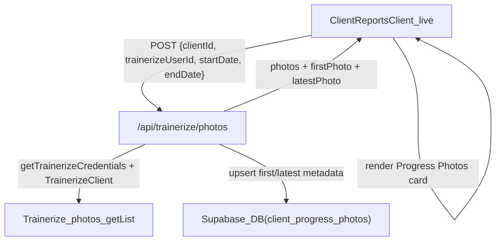

# Progress photos in reports

## Overview

- **Goal**: Surface Trainerize progress photos in the reporting experience for a client and **persist the earliest and latest photo per client** in Supabase.
- **Scope**: New Supabase table, a Trainerize photos API integration, and UI additions in the client reports page (`app/dashboard/clients/[id]/reports`), keeping consistent with existing Trainerize + Supabase patterns.

## Data model changes (Supabase)

- **New table**: `public.client_progress_photos` for per-trainer, per-client progress photo metadata.
  - Columns:
    - `id uuid primary key default gen_random_uuid()`
    - `trainer_id uuid not null references auth.users(id) on delete cascade`
    - `client_id uuid not null references public.clients(id) on delete cascade`
    - `trainerize_user_id bigint not null` (mirror of `clients.trainerize_id` for safety)
    - `first_photo_url text`
    - `first_photo_taken_at timestamptz`
    - `latest_photo_url text`
    - `latest_photo_taken_at timestamptz`
    - `last_synced_at timestamptz`
    - `created_at timestamptz not null default now()`
    - `updated_at timestamptz not null default now()`
  - Indexes & constraints:
    - Unique composite index on `(trainer_id, client_id)` for idempotent upserts.
    - Simple indexes on `trainer_id` and `client_id` for lookups from the app.
  - Row Level Security (RLS):
    - Enable RLS on `client_progress_photos`.
    - Policies (similar to `client_tasks` and `reports`):
      - `SELECT`: `trainer_id = auth.uid()`.
      - `INSERT` / `UPDATE` / `DELETE`: `trainer_id = auth.uid()`.
- **Migration file**:
  - Add a new SQL migration under `supabase/migrations/` that creates the table, indexes, RLS policies, and `updated_at` trigger using the existing `public.handle_updated_at()` if appropriate.

## Backend: Trainerize photos API route

### New route

- **File**: `app/api/trainerize/photos/route.ts`.
- **Method**: `POST` only.
- **Request body**:
  - `clientId`: our internal `clients.id` (UUID).
  - `trainerizeUserId`: the Trainerize `userID` (from `clients.trainerize_id`).
  - `startDate`, `endDate`: date strings in `YYYY-MM-DD` (matching other Trainerize calls).

### Implementation steps

- **1. Auth and client access check**
  - Use `createClient` from `[libs/supabase/server.ts](libs/supabase/server.ts)`.
  - Call `supabase.auth.getUser()`; return 401 JSON if unauthenticated.
  - Query `public.clients` to:
    - Ensure `clientId` belongs to `user.id` (`trainer_id = user.id`).
    - Read `trainerize_id` and validate it matches `trainerizeUserId` or derive `trainerizeUserId` directly from the row.
  - On missing or mismatched data, return 400/404 with a clear error.
- **2. Get Trainerize credentials and client**
  - Use `getTrainerizeCredentials(user.id)` and `createTrainerizeClient(credentials)` from:
    - `[libs/trainerize/credentials.ts](libs/trainerize/credentials.ts)`
    - `[libs/trainerize/client.ts](libs/trainerize/client.ts)`
  - If credentials are missing, return 400 with a helpful error.
- **3. Call Trainerize photos endpoint**
  - Use the low-level Trainerize client: `client.request<TrainerizePhotosResponse>("/v03/photos/getList", { method: "POST", body: { userID, startDate, endDate } })`.
  - Define a narrow `TrainerizePhotosResponse` type based on expected structure, focusing on fields we need: `id`, `photoUrl`, `date` / `createdAt`, etc.
  - Normalize into an internal `ProgressPhoto` type:
    - `id: string | number`
    - `url: string`
    - `takenAt: string` (ISO timestamp)
- **4. Compute first and latest photo**
  - Sort or reduce the photo list by `takenAt` to find:
    - `earliestInRange`
    - `latestInRange`
  - Convert Trainerize timestamps to UTC ISO strings before persistence to keep consistency with other tables.
- **5. Upsert into `client_progress_photos**`
  - Lookup existing record where `trainer_id = user.id` and `client_id = clientId`.
  - If no record exists and we have at least one photo:
    - Insert row with `trainer_id`, `client_id`, `trainerize_user_id`, `first_photo_*` and `latest_photo_*` set from the batch, and `last_synced_at = now()`.
  - If record exists:
    - Compare `earliestInRange` vs existing `first_photo_taken_at`; if earlier, update `first_photo_*`.
    - Compare `latestInRange` vs existing `latest_photo_taken_at`; if later, update `latest_photo_*`.
    - Always bump `last_synced_at` when we successfully fetch photos.
  - If there are **no photos in the range**:
    - Do not change existing first/latest values; only consider setting `last_synced_at` or leaving the row as-is.
- **6. Response shape**
  - Return JSON like:
    - `photos: ProgressPhoto[]` (current range only).
    - `firstPhoto: ProgressPhoto | null` (derived from `client_progress_photos` row after update, if fields present).
    - `latestPhoto: ProgressPhoto | null`.
  - Handle and log Trainerize errors using `TrainerizeClientError` where applicable; map to 4xx/5xx HTTP responses with user-friendly messages.

### Optional caching (future-friendly)

- Extend `TrainerizeCacheParams.type` in `[lib/trainerize-cache.ts](lib/trainerize-cache.ts)` to include `'photos'`.
- Wrap the raw Trainerize call in `getTrainerizeDataWithCache` to reuse responses for the same `(trainerId, clientId, type, startDate, endDate)`.
- For the first implementation, we can skip this and add it later if needed.

## Frontend: Integrate photos into the reports UI

### Where to hook

- **Page shell**: `[app/dashboard/clients/[id]/reports/page.tsx](app/dashboard/clients/[id]/reports/page.tsx)`
  - No change required for initial implementation; it already passes `clientId` and live report data down to `ClientReportsClient`.
- **Main UI**: `[app/dashboard/clients/[id]/reports/ClientReportsClient.tsx](app/dashboard/clients/[id]/reports/ClientReportsClient.tsx)`
  - This component manages tabs, date range, and live vs snapshot views; it is the best place to fetch and display photos.

### State and data fetching in `ClientReportsClient`

- **New types** inside `ClientReportsClient`:
  - `interface ProgressPhoto { id: string; url: string; takenAt: string; }`
  - `interface ProgressPhotoSummary { firstPhoto: ProgressPhoto | null; latestPhoto: ProgressPhoto | null; }`
- **New React state**:
  - `const [progressPhotos, setProgressPhotos] = useState<ProgressPhoto[]>([]);`
  - `const [photoSummary, setPhotoSummary] = useState<ProgressPhotoSummary>({ firstPhoto: null, latestPhoto: null });`
  - `const [isLoadingPhotos, setIsLoadingPhotos] = useState(false);`
  - `const [photosError, setPhotosError] = useState<string | null>(null);`
- **Effect to load photos** (Live tab only):
  - `useEffect` with deps `[activeTab, client, startDate, endDate]`.
  - Guard: only fetch when `activeTab === 'live'`, `client` is loaded, and both `startDate` and `endDate` are set.
  - Call `fetch('/api/trainerize/photos', { method: 'POST', body: JSON.stringify({ clientId, trainerizeUserId: client.trainerize_id, startDate: yyyyMmDd(startDate), endDate: yyyyMmDd(endDate) }) })`.
  - On success:
    - Update `progressPhotos` and `photoSummary` from response.
    - Clear `photosError`.
  - On error:
    - Set `photosError` and use `toast.error` to inform the user; do not block main report rendering.

### Progress Photos card UI

- **Placement**:
  - In Live tab, below the "Live Report Display" card and above the "Action Plan" card, add a new **"Progress Photos"** card.
- **Design** (using existing design language):
  - Wrap in `card-elevated` with padding similar to other cards.
  - Header:
    - Title: "Progress Photos".
    - Subtitle: short explanation, e.g. "Visual changes for this report period and all-time snapshots".
  - Body:
    - **Loading state**: show spinner (`loading loading-spinner`) when `isLoadingPhotos` is true.
    - **Error state**: if `photosError` is set, show a subtle alert with the message.
    - **No-photo state**: if `progressPhotos` is empty and both `firstPhoto` and `latestPhoto` are null, show a friendly message like "No progress photos available yet for this client".
    - **Current range carousel/grid**:
      - If `progressPhotos.length > 0`, show a horizontal scroll or simple grid of thumbnails (e.g. 3–4 per row) with dates under each.
      - Click (or tap) can open a basic full-size overlay/`<dialog>` or a new tab for now.
    - **All-time first vs latest**:
      - Separate section using data from `photoSummary`:
        - Two larger thumbnails: "First Photo" and "Most Recent".
        - Each shows taken date and optionally a small label like "Day 1" vs "Today" when dates are far apart.

### Snapshot tab considerations

- First version: keep progress photos **only on the Live tab** to avoid extra complexity.
- Later enhancement: when viewing a snapshot report in the Snapshots tab, we could reuse the same component but call `/api/trainerize/photos` with the snapshot’s `date_range_start` / `date_range_end` instead of `startDate` / `endDate` state.

## Optional: Enrich report data with photos

- Extend `ReportData` in `[lib/report-generator.ts](lib/report-generator.ts)` to include an optional `progressPhotos` field:
  - Add to the interface: `progressPhotos?: { photos: ProgressPhoto[] }`.
  - Add another `safeFetchTrainerize` call in `generateReportData` to call a new internal `/api/trainerize/photos/raw` route or directly call Trainerize (to avoid circular calls between report generation and the new `/api/trainerize/photos` route).
  - Include photos in the returned `ReportData` so that `/api/reports/generate` responses (and cached `report_cache.report_data`) carry photo information.
- For the initial implementation, **keep this as a later phase** to avoid coupling report generation to the new table.

## Data flow summary (mermaid)

## Edge cases and behavior

- **No Trainerize credentials**:
  - `/api/trainerize/photos` returns 400 with a clear error; UI shows an inline message and keeps the rest of the report working.
- **Client without `trainerize_id**`:
  - Backend returns 400 / 404; UI explains that photos are unavailable until the client is linked to Trainerize.
- **No photos in a date range**:
  - `photos` array is empty; `firstPhoto`/`latestPhoto` may still be populated from previous fetches and can be displayed in the "All-time" section.
- **Time zones**:
  - Normalize all `takenAt` values to UTC ISO strings when saving and when comparing first/latest; display them in the user’s local timezone using `toLocaleDateString` on the client.

## Implementation order

1. **Create Supabase migration** for `client_progress_photos` table, indexes, RLS, and triggers.
2. **Implement `/api/trainerize/photos**` route with:
  - Auth and client ownership checks.
  - Trainerize API call via `TrainerizeClient`.
  - First/latest computation and `client_progress_photos` upsert.
3. **Add types and state to `ClientReportsClient**` and wire up the `useEffect` that calls `/api/trainerize/photos` when Live tab + date range are active.
4. **Build the Progress Photos card UI** in `ClientReportsClient`, covering loading, error, empty, range photos, and all-time first/latest views.
5. **Manual verification**:
  - With a client that has Trainerize photos, confirm:
    - API route returns photos and updates Supabase.
    - First and latest images remain stable across multiple report date ranges.
    - UI behaves correctly when switching date ranges and tabs.
6. (Optional later) **Integrate photos into `ReportData**` and `report_cache` for deeper reuse.

