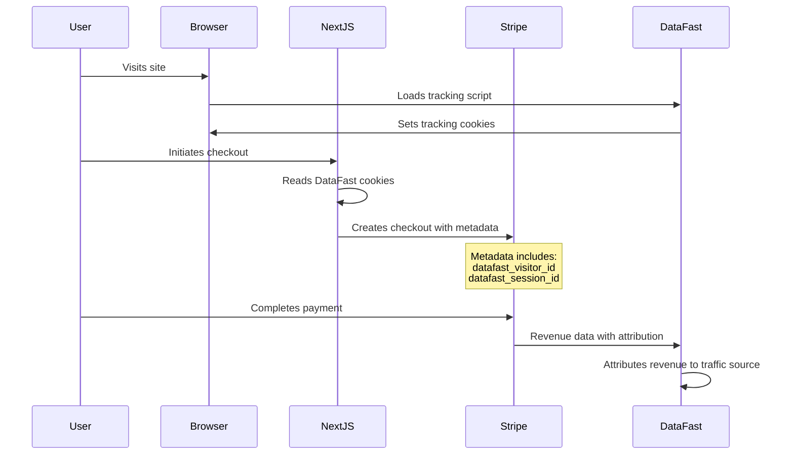

# DataFast Revenue Attribution Setup

## Overview
DataFast server-side tracking has been implemented to automatically attribute revenue to the correct marketing channels. This provides more accurate data than client-side tracking.

## Implementation Status ✅
- [x] Analytics script added to `app/layout.tsx`
- [x] DataFast tracking cookies (`datafast_visitor_id` and `datafast_session_id`) are captured during checkout
- [x] Cookies are passed as metadata to Stripe checkout sessions
- [x] Stripe checkout sessions include DataFast tracking metadata for revenue attribution

## Next Steps (Manual Setup Required)

### 1. Connect Stripe Account to DataFast

1. **Go to DataFast Dashboard**: Visit [https://datafa.st/dashboard](https://datafa.st/dashboard)
2. **Navigate to Website Settings**: Click on your website settings
3. **Go to Revenue Tab**: Find the Revenue section in your website settings
4. **Connect Stripe Account**: Follow the prompts to connect your Stripe account to DataFast

### 2. Verify Implementation

Once you connect Stripe to DataFast:

1. **Test a Purchase**: Complete a test purchase on your application
2. **Check DataFast Dashboard**: Verify that revenue appears in your DataFast analytics
3. **Review Attribution**: Confirm that revenue is attributed to the correct traffic sources

## How It Works



## Code Changes Made

### 1. Analytics Script (`app/layout.tsx`)
```tsx
<Script
  defer
  data-website-id="68417884330d70aeb1bbb6cf"
  data-domain="fitreport.co"
  src="https://datafa.st/js/script.js"
  strategy="afterInteractive"
/>
```

### 2. Checkout API (`app/api/stripe/create-checkout/route.ts`)
```typescript
// Get DataFast tracking cookies for revenue attribution
const cookieStore = cookies();
const datafastVisitorId = cookieStore.get('datafast_visitor_id')?.value;
const datafastSessionId = cookieStore.get('datafast_session_id')?.value;

// Pass to Stripe checkout
const stripeSessionURL = await createCheckout({
  // ... other params
  metadata: {
    datafast_visitor_id: datafastVisitorId || '',
    datafast_session_id: datafastSessionId || '',
  },
});
```

### 3. Stripe Library (`libs/stripe.ts`)
```typescript
interface CreateCheckoutParams {
  // ... existing fields
  metadata?: Record<string, string>;
}

// Stripe session includes metadata
const sessionParams = {
  // ... other params
  ...(metadata ? { metadata } : {}),
};
```

## Benefits

- **Accurate Attribution**: Server-side tracking provides 100% accurate revenue attribution
- **Ad Blocker Resistant**: Revenue tracking works even when users have ad blockers
- **Complete Funnel Visibility**: See which marketing channels drive actual revenue, not just traffic
- **ROI Optimization**: Make data-driven decisions about marketing spend

## Troubleshooting

If revenue isn't appearing in DataFast:

1. **Check Stripe Connection**: Ensure your Stripe account is properly connected in DataFast settings
2. **Verify Cookies**: Check browser dev tools to confirm DataFast cookies are being set
3. **Test Metadata**: Use Stripe dashboard to verify checkout sessions include the DataFast metadata
4. **Contact Support**: Reach out to DataFast support for connection issues

## Testing

To test the implementation:

1. **Clear browser cookies**
2. **Visit your site from a specific traffic source** (e.g., Google, social media)
3. **Complete a test purchase**
4. **Check DataFast dashboard** for the attributed revenue

The revenue should appear in DataFast and be attributed to the correct traffic source that brought the visitor to your site. 